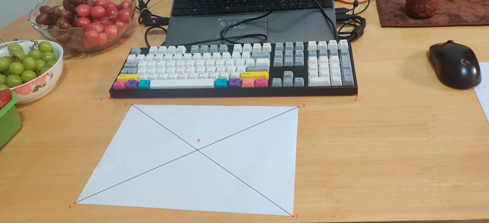

# 单目镜头物体大小估计

## 需要的参数

`f = 焦距`

`ABC三点坐标`

## Example

以左上角为坐标原点

向右 X轴正向

向下 Y轴正向

## 需要的参数

| Parameter | Value / unit |
| :-------: | -----------: |
| `f`       | $26\; mm$     |
| `AC`      | $1609.50\; px$ |
| `BD`      | $1993.30\; px$ |
| `PP'`     | $2022.12\; px$ |
| `AM`      | $659.49\; px$  |
| `CM`      | $949.82\; px$  |
| `BM`      | $1094.97\; px$ |
| `DM`      | $897.61\; px$  |
|  |  |
|  |  |

点的坐标

| Point | (x, y)         |
| ----- | -------------- |
| `A`   | $(1081, 855)$  |
| `B`   | $(607, 1661)$  |
| `C`   | $(2397, 1771)$ |
| `D`   | $(2439, 871)$  |
| `P_1` | $(901, 805)$   |
| `P_2` | $(2919, 787)$  |

$$
\lambda_1 = \frac{AM}{CM} = \frac{659.49}{949.82} = 0.694331557558
$$

$$
\lambda_2 = \frac{BM}{DM} = \frac{1094.97}{897.61} = 1.219872773253
$$

$$
\overrightarrow{OA'} = \hat\lambda_1\overrightarrow{OA} \\

\overrightarrow{OC'} = \hat\lambda_1 \lambda_1 \overrightarrow{OC}
$$

A4 尺寸的对角线：

> A'C' = B'D' =  363.74304117055

$$
\hat\lambda_1 
= \frac{|A'C'|}{|\lambda_1 \cdot \overrightarrow{OC} - \overrightarrow{OA}|}
$$

$$
\hat\lambda_2 
= \frac{|B'D'|}{|\lambda_2 \cdot \overrightarrow{OD} - \overrightarrow{OB}|}
$$

$$
\overrightarrow{A'C'} = \hat\lambda_1 (\lambda_1 \cdot \overrightarrow{OC} - \overrightarrow{OA})
$$

$$
\overrightarrow{B'D'} = \hat\lambda_2 (\lambda_2 \cdot \overrightarrow{OD} - \overrightarrow{OB})
$$

$$
\overrightarrow{n} = \overrightarrow{A'C'} \times \overrightarrow{B'D'} = (-13.427483436876035, -61.46600005731566, -22680.99990105143)
$$

$$
\overrightarrow{OP_i'} = \frac{\overrightarrow{OA'} \cdot \overrightarrow{n}}{\overrightarrow{OP_i} \cdot \overrightarrow{n}} * \overrightarrow{OP_i} \\
$$

| 计算值               | 实际值 | 误差 | 备注    |
| -------------------- | ------ | ---- | ------- |
| `236.09328370753715` | `210`  |      | A4 纸宽 |
|                      |        |      |         |
|                      |        |      |         |

